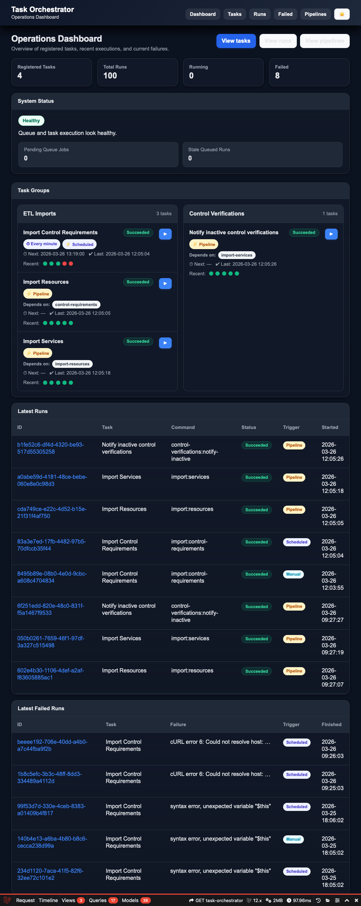

# Laravel Task Orchestrator

A lightweight task orchestration layer for Laravel that adds visibility, dependencies, pipelines, and a modern UI on top of your Artisan commands.

---

## ✨ Features

* 🔗 Task dependencies (`depends_on`)
* 🔄 Automatic pipeline execution (upstream → downstream)
* 🧠 Task discovery via config file
* 📊 Dashboard with real-time status
* 🧩 Pipeline view (visual flow of tasks)
* 🎯 Manual & scheduled triggers
* 🟢 Status tracking (queued, running, succeeded, failed)
* 🧯 Stale run recovery (auto-fail hanging tasks)
* ⏱ Per-task timeout configuration
* 🌙 Dark / Light mode
* 📱 Responsive UI

---

## 📸 Screenshots


---

## 🚀 Installation

```bash
composer require fanat98/laravel-task-orchestrator
```

Publish config and assets:

```bash
php artisan vendor:publish --tag=task-orchestrator-config
php artisan vendor:publish --tag=task-orchestrator-assets
```

Run migrations:

```bash
php artisan migrate
```

---

## ⚙️ Basic Configuration

Config file:

```php
config/task-orchestrator.php
```

Example:

```php
return [
    'route_prefix' => 'task-orchestrator',

    'middleware' => ['web', 'auth'],

    'authorization' => [
        'mode' => 'user_field',
        'field' => 'is_admin',
    ],

    'discovery_path' => app_path('TaskOrchestrator/discovery.php'),

    'fail_on_invalid_dependencies' => false,

    'stale_run_default_minutes' => 10,
];
```

---

## 🧩 Task Discovery

Create:

```bash
app/TaskOrchestrator/discovery.php
```

Example:

```php
<?php

return [
    'commands' => [
        'import:control-requirements' => [
            'name' => 'control-requirements',
            'label' => 'Import Control Requirements',
            'group' => 'ETL Imports',
            'group_order' => 10,
            'order' => 10,
            'connection' => 'database',
            'queue' => 'imports',
            'schedule' => [
                'expression' => '* * * * *',
                'human' => 'Every minute',
            ],
            'timeout_minutes' => 30,
        ],

        'import:resources' => [
            'name' => 'import-resources',
            'label' => 'Import Resources',
            'group' => 'ETL Imports',
            'group_order' => 10,
            'order' => 20,
            'depends_on' => ['control-requirements'],
            'timeout_minutes' => 30,
        ],

        'import:services' => [
            'name' => 'import-services',
            'label' => 'Import Services',
            'group' => 'ETL Imports',
            'group_order' => 10,
            'order' => 30,
            'depends_on' => ['import-resources'],
            'timeout_minutes' => 30,
        ],

        'control-verifications:notify-inactive' => [
            'name' => 'notify-inactive-control-verifications',
            'label' => 'Notify inactive control verifications',
            'group' => 'Control Verifications',
            'group_order' => 20,
            'order' => 10,
            'depends_on' => ['import-services'],
            'timeout_minutes' => 5,
        ],
    ],
];
```

---

## 🔄 Pipelines

Tasks with dependencies automatically form pipelines:

```
control-requirements → resources → services → notify
```

When a task succeeds:

* downstream tasks are triggered automatically
* all runs are grouped into a pipeline

---

## 🧯 Stale Run Recovery

Recover hanging tasks:

```bash
php artisan task-orchestrator:recover-stale-runs
```

Behavior:

* uses per-task `timeout_minutes` if defined
* otherwise uses global config default

---

## 🔐 Authorization

### Option 1 – User field

```php
'authorization' => [
    'mode' => 'user_field',
    'field' => 'is_admin',
],
```

### Option 2 – Gate

```php
Gate::define('viewTaskOrchestrator', fn ($user) => $user->is_admin);
```

---

## 🎨 UI

* Dashboard overview
* Task groups
* Pipeline visualization
* Latest runs
* Failed runs
* Dark / Light mode toggle

---

## 📚 Documentation

More detailed documentation:

* [Installation](docs/installation.md)
* [Configuration](docs/configuration.md)
* [Task Discovery](docs/discovery.md)
* [Pipelines](docs/pipelines.md)
* [Authorization](docs/authorization.md)

---

## 🛠 Requirements

* PHP 8.2+
* Laravel 10 / 11 / 12

---

## 📄 License

MIT
