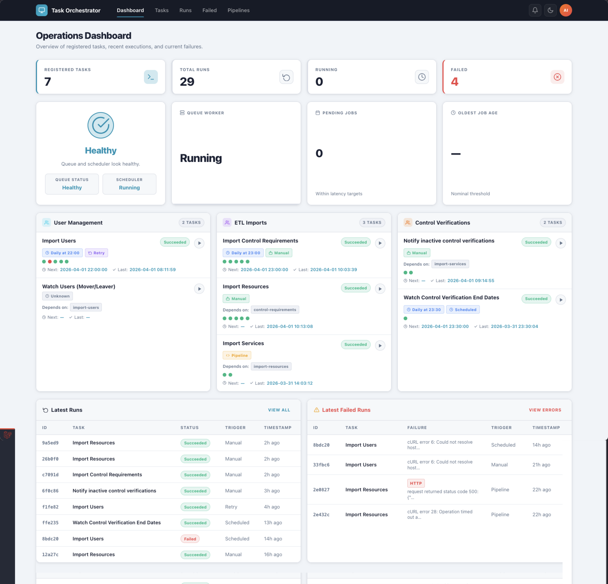

[](https://packagist.org/packages/fanat98/laravel-task-orchestrator)
[](https://packagist.org/packages/fanat98/laravel-task-orchestrator)
[](composer.json)
[](composer.json)
[](composer.json)
[](https://github.com/fanat98/laravel-task-orchestrator/actions/workflows/tests.yml)

# Laravel Task Orchestrator

Laravel Task Orchestrator is a lightweight dashboard for orchestrating Artisan command workflows with dependencies, pipelines, scheduling, queue health checks, stale run recovery and real-time monitoring.

It is built for Laravel teams that already use Artisan commands for imports, sync jobs, maintenance workflows or operational tasks, but need a clearer way to run them, monitor them and connect them into reliable workflows.

Instead of hiding important operational work inside cron entries or one-off commands, the package gives developers and operators a central place to see what can run, what is running, what failed and which downstream tasks should run next.

## When To Use It

Use this package when your Laravel application has Artisan commands that:

- need to run manually from a dashboard
- need to run on a schedule
- depend on other commands finishing successfully
- should be grouped into import, sync, reporting or maintenance pipelines
- need queue, scheduler and worker visibility
- should recover from hanging queued or running states
- need a simple operational UI without building a custom admin tool

## Features

- Task discovery from a small `discovery.php` configuration file
- Manual task starts from a dashboard
- Scheduled task starts using Laravel's scheduler
- Dependency-aware pipelines
- Automatic downstream execution after successful parent tasks
- Queue connection and queue name per task
- Real-time run status, logs and progress display
- Failed run overview and retry support
- Queue, scheduler and queue worker health checks
- Stale queued/running run recovery
- Per-task timeout configuration
- Failure and recovery email notifications
- Dashboard authorization through a gate or user field
- Responsive dashboard with light and dark mode

## Requirements

- PHP 8.2+
- Laravel 12 or 13
- A configured Laravel queue connection
- Laravel's scheduler running in production

## Installation

Install the package with Composer:

```bash
composer require fanat98/laravel-task-orchestrator
```

Publish the configuration and frontend assets:

```bash
php artisan vendor:publish --tag=task-orchestrator-config
php artisan vendor:publish --tag=task-orchestrator-assets
```

Run the package migrations:

```bash
php artisan migrate
```

The dashboard is available at:

```text
/task-orchestrator
```

The path can be changed with `route_prefix` in `config/task-orchestrator.php`.

## Quick Start

Create the discovery file configured by `config/task-orchestrator.php`:

```bash
mkdir -p app/TaskOrchestrator
touch app/TaskOrchestrator/discovery.php
```

Add one command to `app/TaskOrchestrator/discovery.php`:

```php
<?php

return [
    'commands' => [
        'reports:send-daily' => [
            'name' => 'send-daily-reports',
            'label' => 'Send daily reports',
            'group' => 'Reports',
            'queue' => 'default',
            'schedule' => [
                'expression' => '0 8 * * *',
                'human' => 'Daily at 08:00',
            ],
            'timeout_minutes' => 10,
        ],
    ],
];
```

Make sure Laravel's scheduler and at least one queue worker are running:

```bash
php artisan schedule:work
php artisan queue:work
```

For production, run the scheduler from cron and manage queue workers with Supervisor, systemd, Laravel Horizon or your platform's worker process manager.

## Configuration

The package configuration lives in:

```text
config/task-orchestrator.php
```

The most commonly changed options are:

```php
return [
    'route_prefix' => 'task-orchestrator',

    'middleware' => ['web', 'auth'],

    'authorization' => [
        'enabled' => true,
        'mode' => 'gate',
        'gate' => 'viewTaskOrchestrator',
        'user_field' => 'is_admin',
    ],

    'database_connection' => env('TASK_ORCHESTRATOR_DB_CONNECTION'),

    'discovery_path' => app_path('TaskOrchestrator/discovery.php'),

    'fail_on_invalid_dependencies' => false,

    'stale_run_default_minutes' => 10,

    'health' => [
        'queue_stuck_threshold_seconds' => 300,
        'queue_worker' => [
            'heartbeat_max_age_seconds' => 60,
        ],
        'scheduler_heartbeat_max_age_seconds' => 180,
    ],

    'notifications' => [
        'enabled' => false,
        'recipients' => [],
    ],
];
```

For dashboard access, define the configured gate:

```php
use Illuminate\Support\Facades\Gate;

Gate::define('viewTaskOrchestrator', function ($user) {
    return (bool) $user->is_admin;
});
```

For smaller applications you can also use `mode => user_field` and set `user_field => is_admin`.

## Defining Tasks

Tasks are declared in the discovery file under the `commands` key. Each array key is an Artisan command signature and each value describes how Task Orchestrator should present and run it.

```php
<?php

return [
    'commands' => [
        'import:users' => [
            'name' => 'import-users',
            'label' => 'Import users',
            'description' => 'Imports users from the external source.',
            'group' => 'Imports',
            'group_order' => 10,
            'order' => 10,
            'connection' => 'database',
            'queue' => 'imports',
            'schedule' => [
                'expression' => '*/15 * * * *',
                'human' => 'Every 15 minutes',
            ],
            'timeout_minutes' => 20,
        ],
    ],
];
```

Supported task metadata includes:

- `name`: unique task identifier used by dependencies
- `label`: human-readable dashboard label
- `description`: optional dashboard description
- `group`, `group_order`, `order`: dashboard organization
- `depends_on`: task names that must succeed before this task runs
- `connection`: queue connection for the task run
- `queue`: queue name for the task run
- `schedule.expression`: cron expression for scheduled runs
- `schedule.human`: readable schedule text for the dashboard
- `timeout_minutes`: per-task stale run timeout
- `notifications`: optional per-task notification settings

## Real-World Pipeline Example

This example keeps the commands generic while showing multiple dependencies:

```php
<?php

return [
    'commands' => [
        'import:users' => [
            'name' => 'import-users',
            'label' => 'Import users',
            'group' => 'Imports',
            'order' => 10,
            'queue' => 'imports',
            'schedule' => [
                'expression' => '0 * * * *',
                'human' => 'Hourly',
            ],
            'timeout_minutes' => 20,
        ],

        'watch:users' => [
            'name' => 'watch-users',
            'label' => 'Watch imported users',
            'group' => 'Imports',
            'order' => 20,
            'depends_on' => ['import-users'],
            'queue' => 'imports',
            'timeout_minutes' => 10,
        ],

        'import:control-requirements' => [
            'name' => 'import-control-requirements',
            'label' => 'Import control requirements',
            'group' => 'Reference Data',
            'order' => 10,
            'queue' => 'imports',
            'timeout_minutes' => 30,
        ],

        'import:resources' => [
            'name' => 'import-resources',
            'label' => 'Import resources',
            'group' => 'Reference Data',
            'order' => 20,
            'depends_on' => ['import-control-requirements'],
            'queue' => 'imports',
            'timeout_minutes' => 30,
        ],

        'import:services' => [
            'name' => 'import-services',
            'label' => 'Import services',
            'group' => 'Reference Data',
            'order' => 30,
            'depends_on' => ['import-resources'],
            'queue' => 'imports',
            'timeout_minutes' => 30,
        ],
    ],
];
```

The resulting flows are:

```text
import-users -> watch-users

import-control-requirements -> import-resources -> import-services
```

## Scheduler And Queue Workers

Task Orchestrator registers discovered task schedules with Laravel's scheduler. In local development you can run:

```bash
php artisan schedule:work
```

In production, run Laravel's scheduler every minute:

```cron
* * * * * cd /path/to/application && php artisan schedule:run >> /dev/null 2>&1
```

You also need at least one queue worker:

```bash
php artisan queue:work
```

If tasks use a custom queue such as `imports`, make sure a worker listens to it:

```bash
php artisan queue:work --queue=imports,default
```

The package also registers scheduler heartbeat, queue heartbeat and stale run recovery tasks through Laravel's scheduler.

## Dashboard

After installation, open:

```text
/task-orchestrator
```

The dashboard shows task groups, task status, recent runs, failed runs, pipeline execution, health status and links to run details. The route is protected by the configured middleware and the package authorization middleware.

## Dependencies And Pipelines

Dependencies are defined with `depends_on` using task names:

```php
'import:resources' => [
    'name' => 'import-resources',
    'depends_on' => ['import-control-requirements'],
],
```

When a task succeeds, Task Orchestrator starts downstream tasks whose dependencies are satisfied. Runs created from the same chain share a pipeline context, making it easier to inspect the full workflow.

Execution rules:

- downstream tasks run only after successful dependencies
- failed tasks stop downstream execution
- dependency cycles are rejected
- manual starts run the selected task
- scheduled starts create a new pipeline from the scheduled task
- retries create a new run and can continue downstream execution

## Stale Run Recovery

If a queued or running task hangs, the recovery command marks it as failed after its timeout:

```bash
php artisan task-orchestrator:recover-stale-runs
```

Timeout resolution:

- task-level `timeout_minutes`
- persisted run timeout
- global `stale_run_default_minutes`
- explicit `--minutes=` override

The package schedules stale run recovery automatically. You can still run the command manually during incident response.

## Health Monitoring

The dashboard reports:

- queue state: `healthy`, `busy` or `stuck`
- scheduler state: `running` or `down`
- queue worker state: `running` or `down`

Queue health is based on pending jobs and the configured stuck threshold. Scheduler health is based on a scheduler heartbeat written every minute. Queue worker health is based on a worker heartbeat refreshed by scheduled heartbeat jobs and task execution jobs.

Scheduled tasks are skipped when the queue worker heartbeat is stale or missing. This protects the application from accumulating large numbers of queued orchestrator runs during a worker outage.

## Screenshots

### Dashboard screenshot



### Task detail screenshot

Task detail screenshot placeholder. Add an image to `docs/` and reference it here when available.

### Health monitoring screenshot

Health monitoring screenshot placeholder. Add an image to `docs/` and reference it here when available.

## Troubleshooting

### The dashboard returns 403

Check `authorization.mode`, `authorization.gate`, `authorization.user_field` and the authenticated user. For gate mode, make sure the gate exists in your application.

### No tasks appear in the dashboard

Check that `discovery_path` points to an existing PHP file, the file returns an array and tasks are placed under the `commands` key.

### Scheduled tasks do not run

Make sure Laravel's scheduler is running. Locally, use `php artisan schedule:work`. In production, configure cron to call `php artisan schedule:run` every minute.

### Tasks stay queued

Make sure a queue worker is running for the queue used by the task. If a task uses `queue => imports`, the worker must listen to `imports`.

### The scheduler or queue worker is marked down

Check that the scheduler is running every minute and that queue workers can process heartbeat jobs. Also verify that the application cache is available because heartbeat state is stored in cache.

### A run is stuck in queued or running

Run `php artisan task-orchestrator:recover-stale-runs` and review `timeout_minutes` for long-running tasks.

### Dependencies do not start

Confirm that `depends_on` uses task names, not Artisan command names, and that upstream runs completed successfully.

## Documentation

More detailed documentation:

- [Installation](docs/installation.md)
- [Configuration](docs/configuration.md)
- [Task Discovery](docs/discovery.md)
- [Pipelines](docs/pipelines.md)
- [Operations](docs/operations.md)
- [Authorization](docs/authorization.md)

## Package Status And Support

This package is early but usable. It is intended for Laravel applications that want a lightweight operational dashboard around Artisan command workflows without adopting a larger workflow engine.

Supported runtime versions:

- PHP 8.2+
- Laravel 12 and 13

Issues, bug reports, practical feedback and contributions are welcome through GitHub.

## Testing

Run the package tests with PHPUnit:

```bash
vendor/bin/phpunit --configuration phpunit.xml --no-coverage
```

When developing this package as a local path repository inside a host application, you can also use the host application's PHPUnit binary:

```bash
../../vendor/bin/phpunit --configuration /absolute/path/to/packages/laravel-task-orchestrator/phpunit.xml --no-coverage
```

## License

The package is open-sourced software licensed under the MIT license. The license declaration is available in [composer.json](composer.json).
